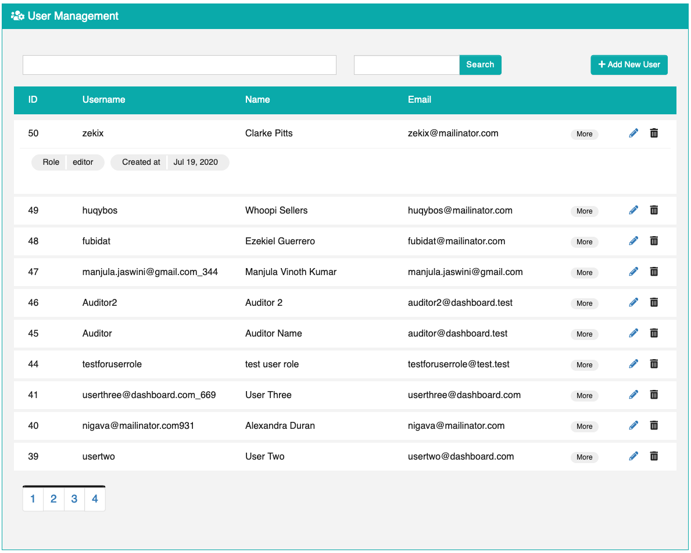
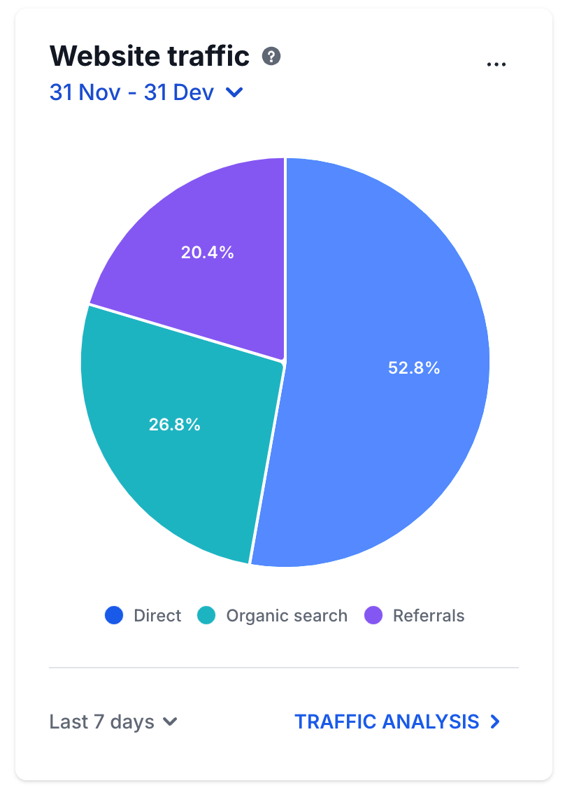

# 📖 Tutorial: Workshop Test fo Build Frontend for RESTful API on Go

👉 Repository นี้สร้่างขึี้นเมื่อ **Augest 18, 2024**


## 📝 คำอธิบาย

เป้าหมายของโปรเจคนี้คือการสร้าง Frontend ที่สามารถจัดการข้อมูลต่างๆ ผ่าน RESTful API โดยมีฟีเจอร์ดังต่อไปนี้:

- **Users**: สามารถทำการแก้ไข, ลบ, กรอง, เพิ่ม และดูสถิติ
- **Order**: สามารถทำการแก้ไข, ลบ, กรอง, เพิ่ม และดูสถิติ
- **Product**: สามารถทำการแก้ไข, ลบ, กรอง, เพิ่ม และดูสถิติ

**ภาพตัวอย่าง:**
- **Management Interface:** 
- **Statistics Chart:** 

์Needed --> Fiber, MongoDB, Redis, Next, Flowbite สำหรับทำ Chart Statistics 

## 🐱 Web Development (Front-end)
| ลำดับที่ | Name       | Version       | Install Command                        |
|:--------:|:----------:|:-------------:|:--------------------------------------:|
| 1        | Next.js    | **14.2**      | `npx create-next-app@latest`           |
| 2        | Flowbite   | **latest**    | `npm install tailwindcss flowbite flowbite-react` |

## 🧲 Web Development (Back-end)
| ลำดับที่ | Name   | Version     | Install Command                                |
|:--------:|:------:|:-----------:|:----------------------------------------------:|
| 1        | Go     | **1.23.0**  | **(MacOS)** `brew update && brew install golang` |
| 2        | Fiber  | **1.17**    | `go get github.com/gofiber/fiber/v2`          |

## 👒 Database
| ลำดับที่ | Name    | Version     | Install Command                                    |
|:--------:|:-------:|:-----------:|:--------------------------------------------------:|
| 1        | MongoDB | **7.0.2**   | `brew tap mongodb/brew && brew install mongodb-community@7.0` |
| 2        | Redis   | **7.0.11**  | `brew install redis`                              |

## 🤖 Tools and Utilities
| ลำดับที่ | Name            | Install Command            |
|:--------:|:---------------:|:--------------------------:|
| 1        | Git & GitHub     | `brew install git`         |
| 2        | Postman          | `brew install --cask postman` |
| 3        | Docker           | `brew install --cask docker` |
| 4        | Docker Compose   | `brew install docker-compose` |


# 📖 Quick start

## 👨‍💻 Frontend Setup (Next.js)

1. **Create a New Next.js Project:**
   ```bash
   npx create-next-app@latest frontend --typescript
   cd frontend
   ````

2. **Install Dependencies:**
    ```bash
   npm install tailwindcss flowbite flowbite-react
   ````

3. **Set Up TailwindCSS:**
    ```bash
   npx tailwindcss init -p
   ````

4. **Configure TailwindCSS:**
   - Open `tailwind.config.ts` and add the following content:
     ```typescript
     import type { Config } from "tailwindcss";

        const config: Config = {
        content: [
            "./src/pages/**/*.{js,ts,jsx,tsx,mdx}",
            "./src/components/**/*.{js,ts,jsx,tsx,mdx}",
            "./src/app/**/*.{js,ts,jsx,tsx,mdx}",
        ],
        theme: {
            extend: {
            backgroundImage: {
                "gradient-radial": "radial-gradient(var(--tw-gradient-stops))",
                "gradient-conic":
                "conic-gradient(from 180deg at 50% 50%, var(--tw-gradient-stops))",
            },
            },
        },
        plugins: [],
        };
        export default config;
    ````

    - Add TailwindCSS to 'styles/globals.css'
    ``javascript
        @tailwind base;
        @tailwind components;
        @tailwind utilities;
    ```

## 🧲 Backend Setup (Go with Fiber)

1. **Install Dependencies:**
    ```bash
   go get -u github.com/gofiber/fiber/v2
   ````

2. **Config for Database & Redis**
    change to your own database & redis
    ```go
    package config

    const (
        //Redis Config
        RedisAddr    = "localhost:6379"
        RedisPass	 = ""
        RedisDB		 = 0

        //MongoDB Config
        MongoURI     = "mongodb://localhost:27017/test"
    )
    ````